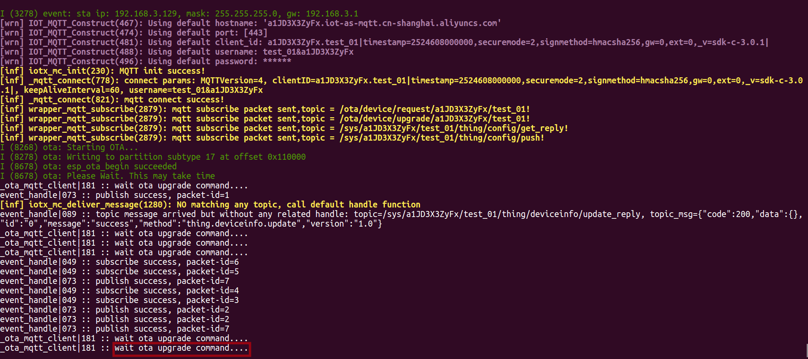
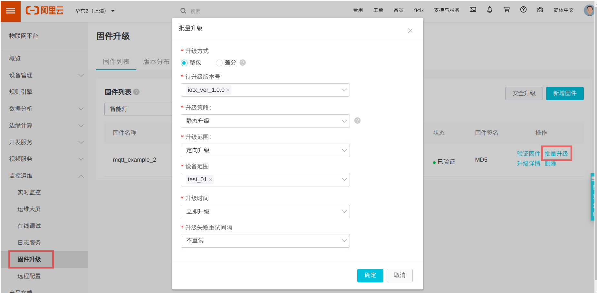
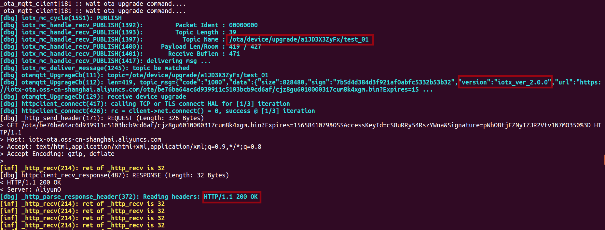
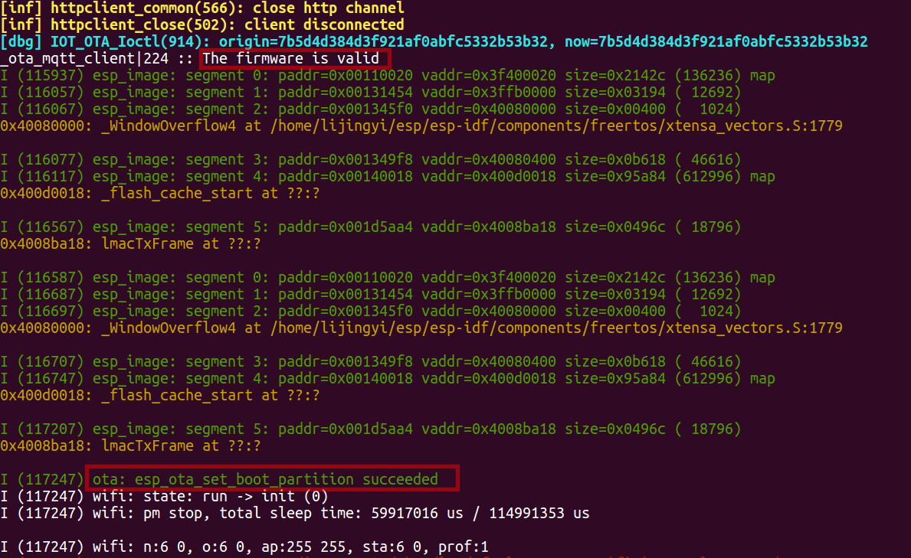
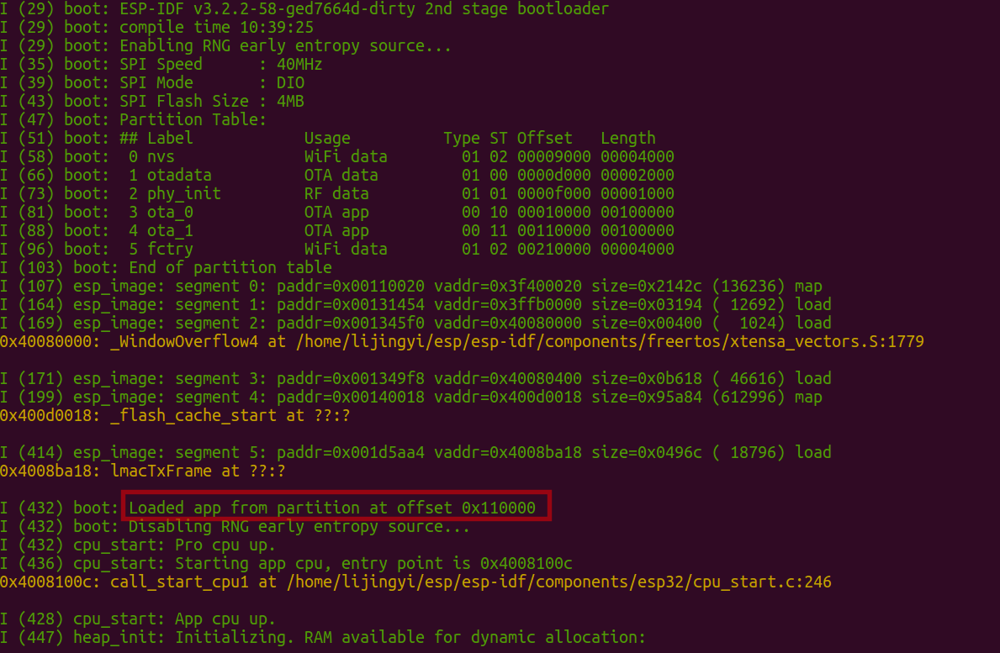

# OTA 解决方案

### 介绍
`ota_example_mqtt` 为客户提供连接阿里云, 云端通过 MQTT 协议下发升级指令, 进行升级固件的示例.

### 解决方案部署
#### 1.参考 [README](../../../README.md) 文档进行硬件准备、环境搭建、SDK 准备

#### 2.阿里云平台部署
在阿里云 [物联网平台](https://iot.console.aliyun.com) 创建产品. 或者在阿里云 [生活物联网平台](https://living.aliyun.com/#/) 创建产品, 会显示在 `物联网平台`, 参考[创建产品文档](https://living.aliyun.com/doc#readygo.html).
> 如果已经创建过产品, 可跳过此步骤.  
> 创建产品设备后,可以获取`三元组`, 后续需要烧录到 NVS 分区.

#### 3.下载本工程
   ```
    git clone https://github.com/espressif/esp-ali-smartliving.git
    cd esp-ali-smartliving
   ```

#### 4.烧录三元组信息
- 参考 [量产说明](../../../config/mass_mfg/README.md) 文档烧录三元组 NVS 分区.

> 如果执行了 `make erase_flash`, 需要重新烧录三元组.

#### 5.编译 `ota_example_mqtt` 并烧录运行
```
cd examples/ota/ota_example_mqtt
make chip=esp32 defconfig 或者 make chip=esp8266 defconfig
make menuconfig
```


- 配置烧写串口
- 配置 `WIFI_SSID`, `WIFI_PASSWORD`

```
make -j8 flash monitor
```

#### 6.设备运行

设备建立 MQTT 连接之后等待升级.
> 设备需要上报固件版本号, 才能响应升级指令.



在[管理控制台](https://iot.console.aliyun.com/ota/list)上传固件, 验证固件后, 下发升级指令.
> 上传固件版本号需要和当前版本号不同.
> 上传固件版本名称与实际固件版本保持一致.



设备端收到升级指令后, 即开始 OTA:


升级完成后, 会检查固件的有效性, 在固件有效时，立即重启运行新固件:



上报版本号和固件版本名称一致时, 管理控制台显示升级成功.